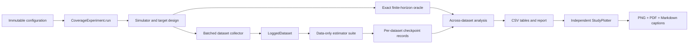

# Architecture and typed API

## Design boundary

Only `environment.py`, `collection.py`, and the design side of `experiment.py`
access simulator dynamics. `estimators.py`, `weights.py`, `policies.py` and `data.py`
have no environment imports. An AST regression test enforces that boundary.
Oracle truth is attached to records *after* estimator evaluation. `EvaluationContext`
contains only target probabilities, gamma and a declared support audit.

## Responsibilities

| Module / object | Responsibility |
|---|---|
| `config.py` / frozen dataclasses | Validate scientific settings and load separate JSON files |
| `randomness.py` / `SeedManager` | Stable semantic 128-bit PCG64 streams |
| `policies.py` / `TabularPolicy`, `SupportAudit` | Immutable stochastic tables and declared support |
| `environment.py` / `FrozenLakeModel` | Gymnasium adapter, exact oracle and reachable-state audit |
| `collection.py` / `DatasetCollector` | Sample complete independent trajectories, record exact propensities |
| `data.py` / `LoggedDataset` | Validated read-only ragged arrays, episode slicing, portable persistence |
| `weights.py` / `ImportanceWeights` | Shared stable ratios, WIS normalization and ESS diagnostics |
| `estimators.py` / `OPEEstimator`, `EstimatorSuite` | Uniform data-only interface and configured method construction |
| `TabularFQE` / `FQEFit` | Stationary sample pooling with finite-horizon Q_t tables |
| `CrossFittedDR` | Whole-episode nuisance separation and weighted residual correction |
| `artifacts.py` / `ArtifactStore` | Atomic checkpoints, code/lock snapshots, hashes and resume validation |
| `experiment.py` / `CoverageExperiment` | One-method experiment execution, main/stress grid, audit trail |
| `analysis.py` / `ResultsAnalyzer` | Independent metrics, bootstrap intervals and paired comparisons |
| `plotting.py` / `StudyPlotter` | Saved-table-only publication figures and captions |
| `cli.py` | Thin command dispatcher; no scientific calculations |

`FloatArray`, `IntArray` and `BoolArray` aliases annotate NumPy dtypes. Runtime
validation checks shapes and scientific constraints that static typing cannot
express. Public function signatures are typed; strict mypy is required. Docstrings
use reStructuredText `:param:`, `:returns:` and `:raises:` where appropriate.
Dynamic JSON dictionaries are used only at serialization/reporting boundaries.

## Estimator extension

Subclass `OPEEstimator` and implement `evaluate(data, context) -> Estimate`. The
new method should return an explicit support status independently of its numeric
output. It must not request the simulator/oracle or infer structural support from
sample counts. Add its identifier to `EstimatorName`, `ESTIMATOR_NAMES`, and the
suite factory, then add a plotting color/marker and tests for its mathematical
properties. The runner, checkpoints and statistics use the shared interface.

Use `TabularFQE.fit` when a nuisance Q table is needed rather than duplicating
Bellman logic. Use `ImportanceWeights` for ratios rather than introducing a second
implementation. `LoggedDataset.subset` accepts complete episode indices and
preserves all chronology checks; use it for sample splitting.

Changing reward schedules, time-dependent transition pooling, initial laws or
propensity estimation changes the scientific design, not just a method name.
Create a new protocol/config/run and adapt the environment/collector or FQE model
sharing assumptions explicitly. Current scope is fixed 4×4 FrozenLake; unsupported
map settings are rejected instead of silently changing the research question.

## Reproducibility and lifecycle

Each cell has `(scope, N, lambda, repetition)` coordinates. SHA-256 encodes these
coordinates plus a stream label; NumPy SeedSequence derives a 128-bit PCG64 seed.
Labels are independent of grid traversal. Float hexadecimal filenames avoid
rounded-lambda collisions. Seed integers are saved as exact decimal strings.

A POSIX advisory lock prevents simultaneous writes to a run; the OS releases
the lock on interruption or process exit. Each record is atomically installed only
after its referenced files are complete and hashed. A failed or interrupted run
retains completed records. Resume verifies matching config/source/protocol/lockfile
and integrity before skipping a record. It never combines methods from one source
version with methods from another. Timing is saved but is not a seeded result.

## Verification

Tests cover analytical IS/WIS/PDIS; time-indexed FQE and terminal masking; zero
target probability; overflow rejection; exhaustive expected DR under independent
nuisance folds; uneven fold weighting; on-policy weights; IS/PDIS identity; exact
Gymnasium transition adaptation; simulator frequency/DP agreement; log roundtrip,
chronology, seeds, support failures, checkpoint integrity, saved-table regeneration
and all figure/caption outputs. The test cases check properties, not preferred
method rankings. `make check` also runs Ruff formatting/lint and strict mypy.
